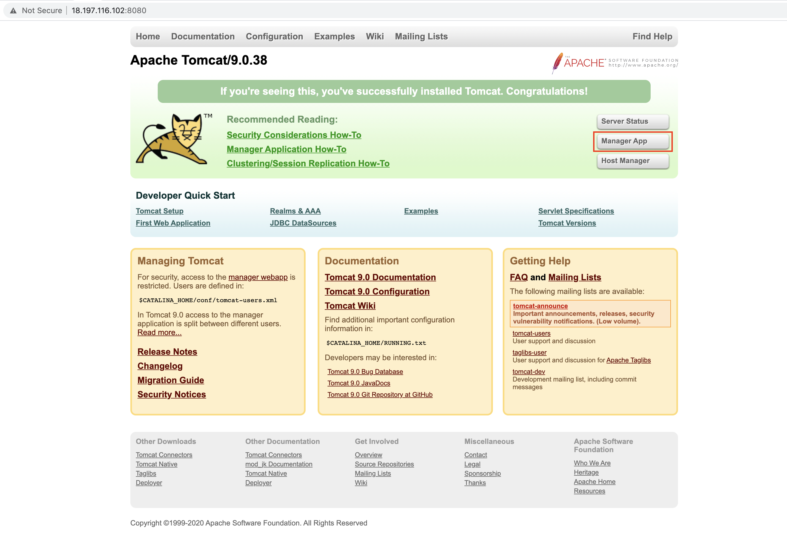
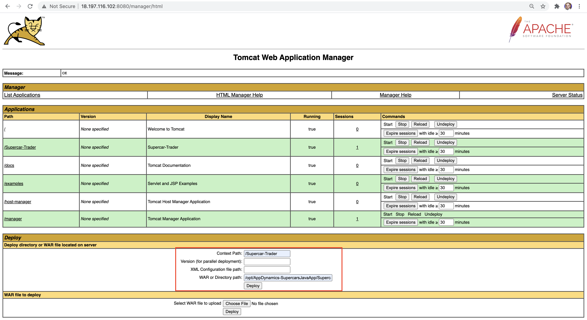

# Supercar Trader Readme

This is a simple Struts application which provides for an online supercar store which has some performance/code issues. The application can be built with Maven.

## Architecture

The application is based on a Struts front end, using a [MySQL](https://www.mysql.com) back end.  MySql 5.7 is recommended.

## Database

The app uses a MySQL DB in the backend, the default schema is expected to be the "supercars" schema, and MySQL running on the same host as the application. The database build scripts are in "src/main/resources/db"

There are three scripts you will need to run in order:

- mysql-01.sql
- mysql-02.sql
- mysql-03.sql

The datasouce is defined in context.xml in src/webapp/META-INF

## Building

This app uses [Maven](https://maven.apache.org) for the build. To get a build environment working:

1. Have [Git](https://git-scm.com) installed and working
1. Get [Maven](https://maven.apache.org) installed
	- Create a new Directory "/opt/maven/apache-maven"
		<pre><code>
 		sudo  mkdir -p /opt/maven
		sudo chown -R [your-user]:[your-user] /opt/maven  (if you are not executing  as the root user)
 		</code></pre>
	- Logout, and Install the tar.gz package from the Maven site on your Local System (note to update theversions below based on the  one downloaded)
	- Copy the tar file  to your host
		<pre><code>
 		scp -i key.pem apache-maven-3.6.3-bin.tar.gz [your-user]@[ip-address]:/opt/maven/apache-maven
 		</code></pre>
	- Login back to your host and Unpack the tar file file "/opt/maven/apache-maven/"
		<pre><code>
 		tar -C /opt/maven -xvf /opt/maven/apache-maven-3.6.3-bin.tar.gz
 		</code></pre>
	- Add the Maven bin directory to your path, e.g. in ".bash_profile" add:
		<pre><code>
 		cd ~
		vi .bash_profile 
		</code></pre>
		Add then the below:
		<pre><code>
		export M2_HOME=/opt/maven/apache-maven-3.6.3
 		export M2=$M2_HOME/bin
 		export PATH=$PATH:$M2
 		</code></pre>
	- Logout of your shell and then login  again to get the new path
	- Test using the command "mvn". This should run Maven and indicate "Build Failure"
1. Use Git to obtain the source code
	<pre><code>
	cd /opt
 	git clone https://github.com/sherifadel90/AppDynamics-SupercarsJavaApp.git
 	</code></pre>
1. Change to the Supercar-Trader Applicationdirectory and then execute the following for the build
	<pre><code>
	sudo chown -R [your-user]:[your-user] /opt/AppDynamics-SupercarsJavaApp  (if you are not executing  as the root user)
	cd /opt/AppDynamics-SupercarsJavaApp/Supercar-Trader
	mvn install
	</code></pre>
1. This should run and leave "Supercar-Trader.war" in the "target/" directory
1. Install Java
	- Run the below (may change  based on your linux distribution)
		<pre><code>
 		sudo yum install java-1.8.0 (may vary based on your linux distro)
 		</code></pre>
	- Check the Java Version
		<pre><code>
 		java -version
		===OUTPUT===
		openjdk version "1.8.0_265"
		OpenJDK Runtime Environment (build 1.8.0_265-b01)
		OpenJDK 64-Bit Server VM (build 25.265-b01, mixed mode)
 		</code></pre>
1. Install Tomcat
	- We can download Apache tomcat 9 tar.gz either from its official Web site or using wget command from the terminal.
	- Install wget  command  to  directly downlaod Tomcat on  our host fromt the internet
		<pre><code>
 		sudo yum install wget (may vary based on your linux distro)
 		</code></pre>
	- Install Tomcat
		<pre><code>
 		sudo wget http://www-eu.apache.org/dist/tomcat/tomcat-9/v9.0.38/bin/apache-tomcat-9.0.38.tar.gz 
 		</code></pre>
	- Run the beneath tar command to extract Apache tomcat 9 under the /opt folder
		<pre><code>
 		sudo tar -zxpvf apache-tomcat-9.0.38.tar.gz  -C /opt/
		cd /opt/
		sudo mv apache-tomcat-9.0.38 tomcat
		sudo chown -R [your-user]:[your-user] /opt/tomcat  (if you are not executing  as the root user)
 		</code></pre>
	- Before starting the Tomcat Service let’’s first set the required CATALINA_HOME environment variable using below commands :
		<pre><code>
		echo "export CATALINA_HOME='/opt/tomcat/'" >> ~/.bashrc
		source ~/.bashrc
		</code></pre>
1. Run Tomcat
	- By default no user or account is allowed to access Manager GUI Page and Admin Page. So to grant access to the users add the following lines in the file “/opt/tomcat/conf/tomcat-users.xml” at the end just above </tomcat-users> tag
		<pre><code>
		vi /opt/tomcat/conf/tomcat-users.xml
		</code></pre>
		Then add the below just above </tomcat-users> tag to create a User Admin Who can access manager and admin section both
		<pre><code>
		&lt;!-- User linuxtechi who can access only manager section --&gt; 
		&lt;role rolename="manager-gui" /&gt; 
		&lt;user username="manager" password="password" roles="manager-gui" /&gt; 
		&lt;!-- User Admin Who can access manager and admin section both --&gt; 
		&lt;role rolename="admin-gui" />
		&lt;user username="admin" password="password" roles="admin-gui" /&gt; 
		</code></pre>
	- By default, Tomcat manager is configured to be accessed from the same server where it’s installed. If you access manager, you will get 403 error, so For a manager to be accessible from any host/IP, you need to do the following:
		<pre><code>
		vi /opt/tomcat/webapps/manager/META-INF/context.xml
		</code></pre>
		Then comment the Valve Tag to be  similar  to  the below
		<pre><code>
		&lt;Context antiResourceLocking="false" privileged="true" &gt;
		&lt;!--
		  &lt;Valve className="org.apache.catalina.valves.RemoteAddrValve"
			 allow="127\.\d+\.\d+\.\d+|::1|0:0:0:0:0:0:0:1" /&gt;
		-->
		  &lt;Manager sessionAttributeValueClassNameFilter="java\.lang\.(?:Boolean|Integer|Long|Number|String)|org\.apache\.catalina\.filters\.CsrfPreventionFilter\$LruCache(?:\$1)?|java\.util\.(?:Linked)?HashMap"/&gt;
		&lt;/Context&gt;
		</code></pre>
	- Start Tomcat
		<pre><code>
		cd /opt/tomcat/bin/
		./startup.sh
		</code></pre>
	- Open Tomcat URL in the browser to verify its isntallation
		<pre><code>
		Go to http://{ip-address-or-Hostname}:8080/
		</code></pre>

1. Use the Tomcat Manager to deploy the war file
   - Go to Tomcat GUI at http://{ip-address-or-Hostname}:8080/
   - Click  on Manager App button on the right
   
   - Enter the Manager Credentails that we added in the “/opt/tomcat/conf/tomcat-users.xml” file
   - You can either upload the war file through the Tomcat Manager web page or copy the war file to your Tomcat host and and enter the context path and path to the war file as in the example below, we will use the later
   	- The context path of a web application defines the URL that end users will access the application from. So we will add "/Supercar-Trader" where pur  application can be accessed from a URL like http://{ip-address-or-Hostname}:8080/Supercar-Trader.
	- in the WAR directory,  we  will  add the WAR file we  generated  from  the Maven Build,  which should be located at "/opt/AppDynamics-SupercarsJavaApp/Supercar-Trader/target"
	-  Click  Deploy
	 
	
   
   
   You can either upload the war file through the Tomcat Manager web page or copy the war file to your Tomcat host and and enter the context path and path to the war file as in the example below
   
   - Start Tomcat
   Click on “Manager App” , It will prompt us for the User name and password, specify the user’s credentials whatever we set in the file ‘tomcat-users.xml‘
    
1. Now the app is available on "/Supercar-Trader/home.do" on your Tomcat instance
	
