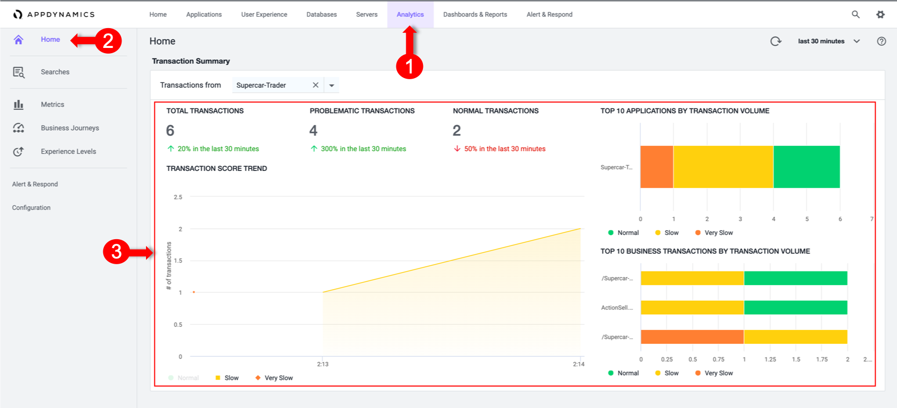

# Enable Analytics on the Application

In this exercise you will access your AppDynamics Controller from your web browser and enable the Analytics from there.

In the example URL below, substitute the IP Address or fully qualified domain name of your Controller VM.

Example Controller URL for browser:

```
http://IP_OR_FQDN_OF_HOST:8090/controller
```

Access the controller login screen from your web browser. You should see the login page of the Controller like the image below.


Use the following case-sensitive credentials to login:

- Username: `admin`
- Password: `welcome1`

Navigate to the Analytics Configuration

1.	Select the **Analytics** tab at the top left of the screen.
2.	Select the **Configuration** Left tab.
3.	Select the **Transaction Analytics - Configuration** tab.
4.	**Mark the Checkbox** next to the SuperCars Application


  

Apply any manual load on the Application, to validate Analytics is working for that Application
1.	Select the **Analytics tab** at the top left of the screen.
2.	Select the **Home** Left tab.
3.	Wait for couple of minutes, and Validate that there is Analytics Data


  

**Next**: Configure HTTP Data Collectors
