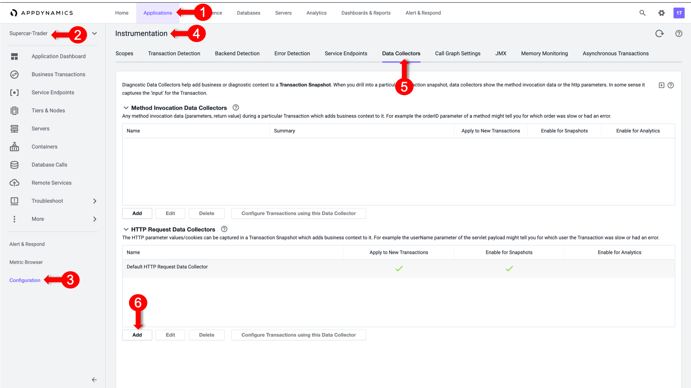
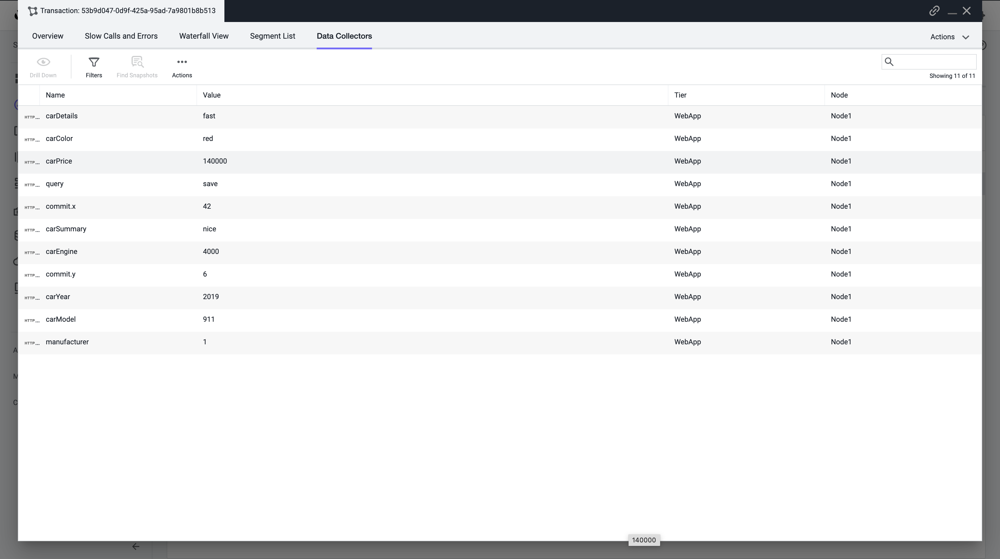

# Configure HTTP Data Collectors

Data collectors allow you to supplement business transaction and transaction analytics data with application data. The application data can add context to business transaction performance issues. For example, they show the values of particular parameters or return value for business transactions affected by poor performance. 
This data shows the business context affected by performance issues, such as the specific user, order, or product.  

HTTP data collectors capture the URLs, parameter values, headers, and cookies of HTTP messages exchanged in a business transaction. 

In this exercise you will perform the following tasks:
- Enable all HTTP Data Collectors
- Observe and Select relevant HTTP Data Collectors
- Capture Business Data in Analytics using HTTP Params
- Validate Analytics on HTTP Parameters

## Enable all HTTP Data Collectors

Initially we can Capture all HTTP Data Collectors to find out what would be the useful parameters that we can capture into Analytics and use it in our Dashboards
Note: This step is strongly recommended on UAT environemnt, not production.

1.	Select the **Applications** tab at the top left of the screen.
2.	Select **Supercar-Trader** Application
3.	Select the **Configuration** Left tab.
4.	Click on the **Instrumentation** Link.
5.	Select the **Data Collectors** tab.
6.	Click on the **Add** Button in the **HTTP Request Data Collectors**

We will configure an HTTP Data Collector to capture all HTTP Parameters. We will only enable it on Transaction Snapshots to avoid any overheads until we figure out the precise Parameters we will need for Transaction Analytics
1.	In the Name, specify it as “All HTTP Param”
2.	Enable Transaction Snapshots
3.	Do Not Enable Transaction Analytics 
4.	Click on “ + Add “ in the HTTP Parameters Section
5.	For the new Parameter, specify “All” as the Display Name, and specify an asterisk “*” in the HTTP Parameter name
6.	Click on Save and enable on "/Supercar-Trader/sell.do" Transaction

## Observe and Select relevant HTTP Data Collectors

1. Apply load on the Application, specifically the “SellCar” transaction. Then open one of its snapshots with Full Call Graph, and select the Data Collectors Tab.
Now all HTTP Parameters are visible. You will find Important Metrics being pulled, like the Colour, Year, Price, etc..

Note down the exact Parameter names to add them again in the HTTP Parameters list and enable them in Transaction Analytics.

## Capture Business Data in Analytics using HTTP Params

We will configure again HTTP Data Collector but this time to capture only the useful HTTP Parameters, and enable them in Transaction Analytics. 
1.	In the Name, specify it as “CarDetails”
2.	Enable Transaction Snapshots
3.	Enable Transaction Analytics 
4.	Click on “ + Add “ in the HTTP Parameters Section
5.	For the new Parameter
6.	Specify “Car Price” as the Display Name, and specify “price” in the HTTP Parameter name
7.	Repeat for all the rest of the Car Parameters 
8.	Click on Save and Enable on SellCar Transaction

### Validate Analytics on HTTP Parameters

We will validate if the business data was captured by HTTP Data collectors in AppDynamics Analytics

1.	Select the Analytics tab at the top left of the screen.
2.	Select the Searches Left tab and Create a New Drag and Drop Search
3.	Validate the our Business Parameters appear as a field in the Custom HTTP Request Data
4.	Validate that the CarPrice Field has Data

**Next**: Configure a Method Invocation Data Collector
