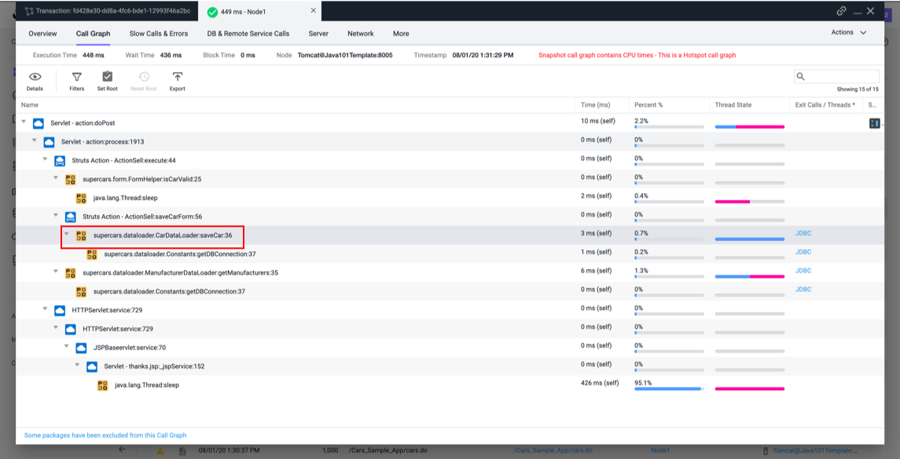
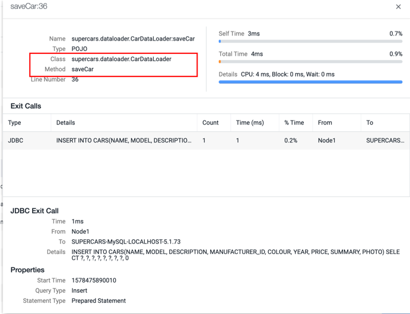
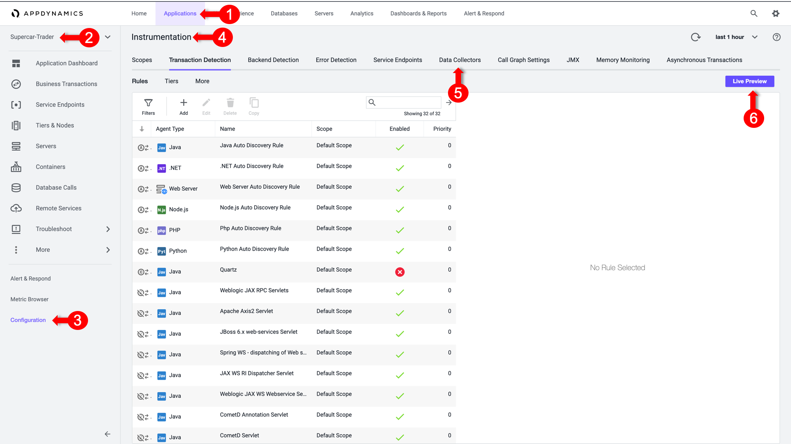
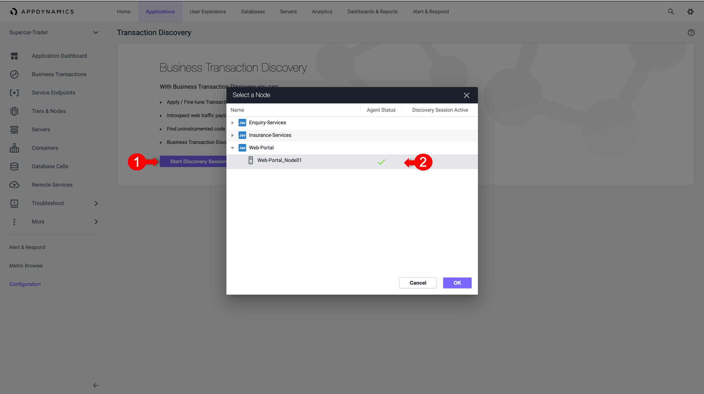
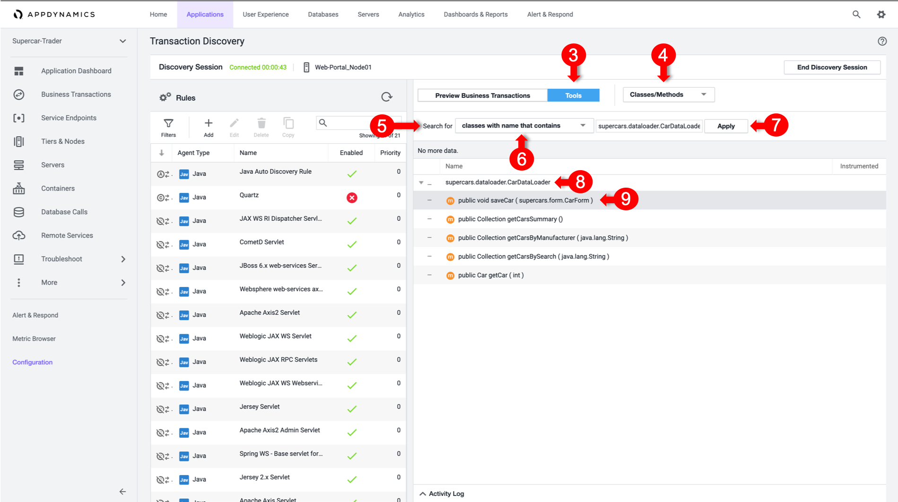
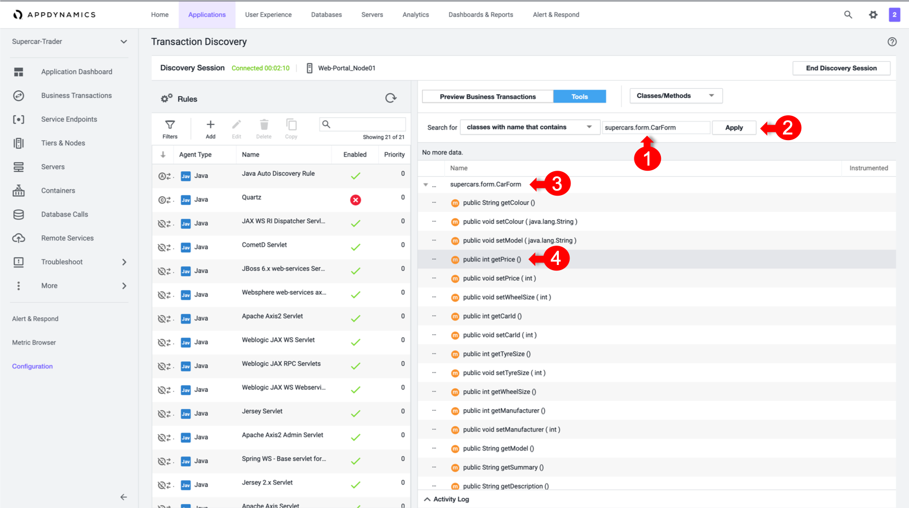
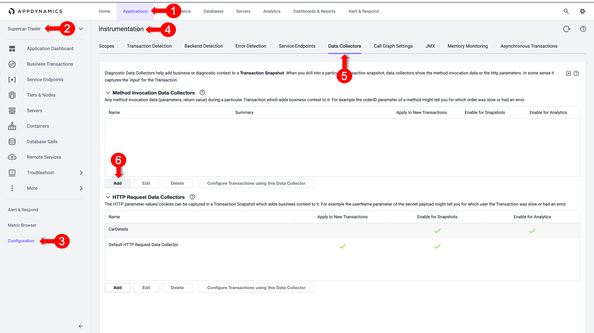
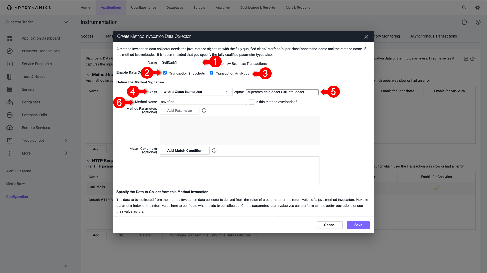
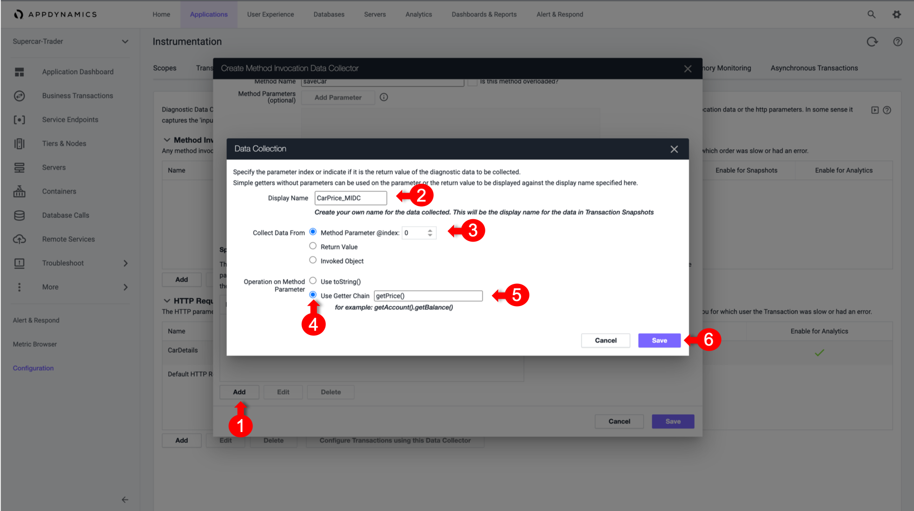
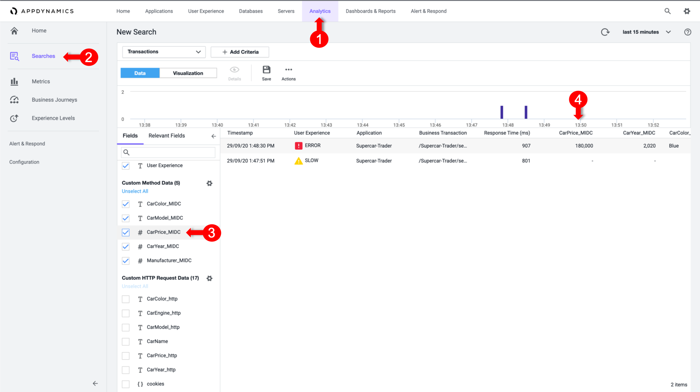

# Configure Method Invocation Data Collectors

Data collectors allow you to supplement business transaction and transaction analytics data with application data. The application data can add context to business transaction performance issues. For example, they show the values of particular parameters or return value for business transactions affected by poor performance. 
This data shows the business context affected by performance issues, such as the specific user, order, or product.  

Method invocation data collectors capture code data such as method arguments, variables, and return values.

In case HTTP Data Collectors don’t have sufficient business data, we can still capture these information from the Code execution

In this exercise you will perform the following tasks:
- Discover Methods
- Open a Discovery Session
- Discover Method Parameters
- Drill Down to an Object within the Code
- Create Method Invocation Data Collector
- Validate Analytics on Method Invocation Data Collectors

## Discover Methods

To  provide a business context  while monitoring our Application, We will discover the Business Data while Selling a Car, like Car Price, Model, etc..
Therefor we have first to identify the method within the Application Code that will most likely be containing this data

1. Open one of the **"/Supercar-Trader/sell.do" Transaction Snapshots** with Full Call Graph
2. **Drill into the Web-Portal** and Expand the Call Graph
3. You’ll notice a **“saveCar” method** being called which is responsible for taking the User Input and saving it to the Database



4. Right click on the method, and select **“View Details”**
5. Note down the **Full Class Name** and the **Method Name**
  ```
  Class Name: supercars.dataloader.CarDataLoader
  Method Name: saveCar
  ```



## Open a Discovery Session

After Identifying the Method that is responsible for the Save Car Operation, next step is to identify which parameters would hold the business data.

If we don’t have the assistance from an Application Developer to identify this from the source code, there is an approach to discover the Application Methods and Objects directly from AppDynamics.

1. Select the **Applications** tab at the top left of the screen.
2. Select **Supercar-Trader** Application
3. Select the **Configuration** Left tab.
4. Click on the **Instrumentation** Link.
5. Select the **Transaction Detection** Tab.
6. Click on the **Live Preview Button** on the Right
 
 
## Discover Method Parameters

1. Click on **Start Discovery Session Tab** at the top right of the screen
2. Select the **Web-Portal Node** in the Pop-up windows (It should be the same Node that the Method we are investigating runs on)


3. Select Tools on the right toggle 
4. Select Classes/Methods in the Drop Down List.
5. Select Classes with name that contains in the Search for section.
6. Type in the Class Name “supercars.dataloader.CarDataLoader” in the Text Box.
7. Click on Apply Button, to search for that Class Methods
8. Once the Results Appear, Expand the Class matching your search
9. Look for the same Method that we noted earlier which is “saveCar”


Note that the saveCar method takes a "CarForm" Object as an input parameter.

## Drill Down to the Object

Now we have reached the method, let’s explore its parameters to find out where we can pull the Car Details properties.

What we observed that Save Car method takes a Complex Object as an Input Parameter "CarForm", where this Object will hold the form data that was filled in the Application Webpage, next we need to inspect that Object and find out how we can pull the Car Details from it.

1. Type in the Class Name of the Input Object **“supercars.form.CarForm”** in the Text Box
2. Click on **Apply** Button, to search for that Class Methods
3. Once the Results Appear, **Expand “supercars.form.CarForm” Class matching the search**
4. Look for **Getters Methods** that would return the car details that we are looking for, you’ll find getters for Price, Model, Color, etc.. 
 

## Create Method Invocation Data Collector

With the above findings, we can now configure a MI Data Collector to pull the Car Details directly from the running code in runtime. 

1.	Select the **Applications** tab at the top left of the screen.
2.	Select **Supercar-Trader** Application
3.	Select the **Configuration** Left tab.
4.	Click on the **Instrumentation** Link.
5.	Select the **Data Collectors** tab.
6.	Click on the **Add Button** in the **Method Invocation Data Collectors**
  
  
We will create a Method Invocation Data Collector to capture the Car Details
1.	In the Name, specify it as **“SellCarMI”**
2.	Enable **Transaction Snapshots**
3.	Enable **Transaction Analytics** 
4.	Select **with a Class Name that**
5.	Add **“supercars.dataloader.CarDataLoader”** as the **Class Name**
6.	Add **“saveCar”** as the **Method Name**
 
 
Then as observed, the Input Parameter of Index 0 in SaveCar Method was an on Object of Class “CarForm”, and then there is a Getter Method inside that object that returns the Car Details properties such as “getPrice()”.

So to explain that how we fetched that value in the MIDC, we will do the below:

1.	Scroll Down and Click on **“Add” to specify a new Data to collect**
2.	In the **Display Name**, specify **“CarPrice_MIDC”**
3.	In the Collect Data From, select **Method Parameter of Index 0**, which is our **CarForm Object**
4.	Then **Operation on Parameter**, select **Use Getter Chain** as we will be calling a Method inside CarForm to return the Car Details
5.	Then specify **getPrice()** which is the Getter method inside CarForm Class to return the price
6.	Click on **Save**
 
7.	Repeat the above steps for **all the properties** (Color, Model, etc..)

8.	**Save MIDC**, and Apply on **"/Supercar-Trader/sell.do" Business Transaction**
 
 
## Validate Analytics on MD Parameters

Go to the  Website, and apply some manual load on the Sell Car Page by submittinng  the form couple of times.
Then, We will validate if the business data was captured by HTTP Data collectors in AppDynamics Analytics

1.	Select the **Analytics** tab at the top left of the screen.
2.	Select the **Searches** Left tab and Create a **New Drag and Drop Search**
3.	Validate the our **Business Parameters** appear as a field in the **Custom Method Data**
4.	Validate that the **CarPrice Field** has Data


## Conclusion

Now We have captured the Business Data from the Sell Car Trasnaction during from the Dode at Runtime, which  can be utilised in the Analytical and Dashboard features within APpDynamics to provide more context to the business and measure IT Impact on Business

**Next**: Understand Dashboard Components
