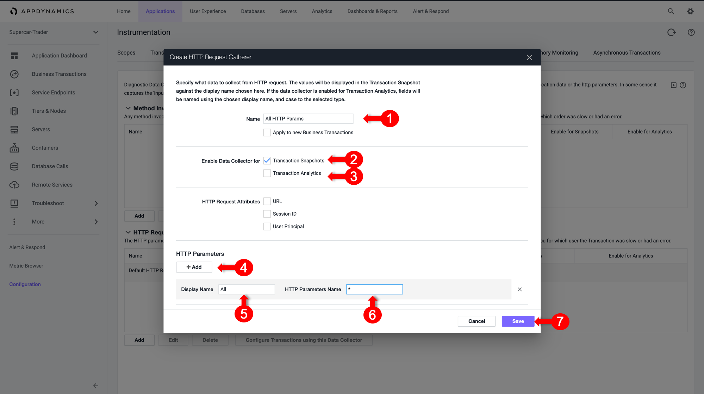

# Configure Method Invoocation Data Collectors

Data collectors allow you to supplement business transaction and transaction analytics data with application data. The application data can add context to business transaction performance issues. For example, they show the values of particular parameters or return value for business transactions affected by poor performance. 
This data shows the business context affected by performance issues, such as the specific user, order, or product.  

Method invocation data collectors capture code data such as method arguments, variables, and return values.

In case HTTP Data Collectors don’t have sufficient business data, we can still capture these information from the Code execution

In this exercise you will perform the following tasks:
- Discover Methods
- Open a Discovery Session
- Discover Method Parameters
- Drill Down to an Object within the Code
- Create Method Invocation Data Collector
- Validate Analytics on Method Invocation Data Collectors

## Discover Methods

To  provide a business context  while monitoring our Application, We will discover the Business Data while Selling a Car, like Car Price, Model, etc..
Therefor we have first to identify the method within the Application Code that will most likely be containing this data

1.	Open one of the "/Supercar-Trader/sell.do" Transaction Snapshots with Full Call Graph
2.	Drill into the Web-Portal and Expand the Call Graph
3.	You’ll notice a “saveCar” method being called which is responsible for taking the User Input and saving it to the Database

4.	Right click on the method, and select “View Details”
5.	Note down the Full Class Name and the Method Name
•	Class Name: supercars.dataloader.CarDataLoader
•	Method Name: saveCar

### Validate Analytics on HTTP Parameters

**Next**: Understand Dashboard Components
