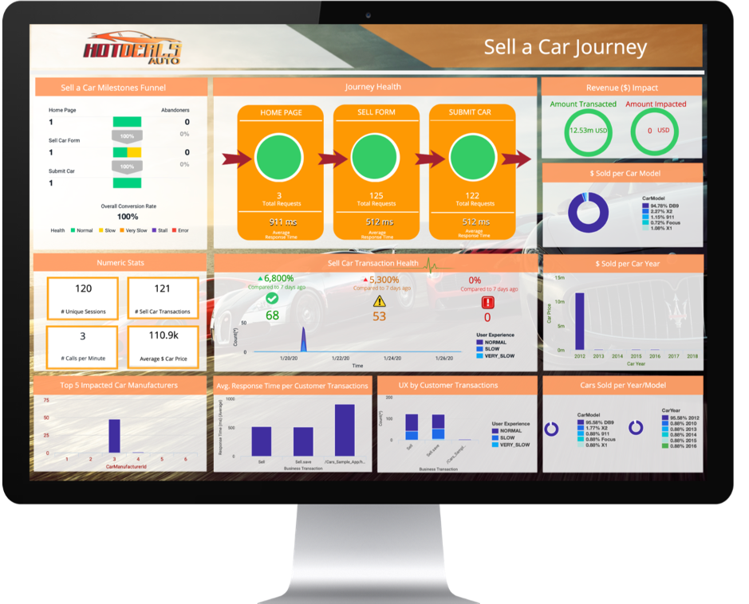

# Exercise: Build your dashboard

To conclude this Learning Lab, use the business data that was captured in the earlier exercise using method invocation data collectors and your understanding of the dashboard components to build an IT Business Impact Dashboard.

Refer to the following example and build your own dashboard, using the same  data and widgets.

**Congratulations! You have completed the BusinessIQ Fundamentals Learning Lab!**
